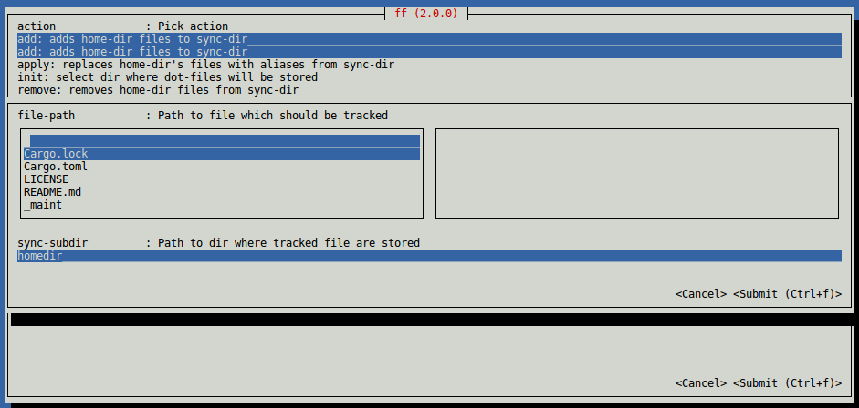

# Description:

`ff` helps you manage dot files by:

- linking files from your homedir to sync dir
- linking files from sync dir to homedir


# Usage

## CLI:

    ```bash
    $ ff add --file-path <file-path>... --sync-subdir <sync-subdir>
    $ ff init --dir-path <dir-path>
    $ ff remove --file-path <file-path>...
    $ ff apply --sync-subdir <sync-subdir>
    ```

## TUI:




## 1. Creating dot-files dir:

```bash
$ # Let's say you want to have `dot-files` dir as a git repo.
$ cd /home/ff-demo
$ mkdir dot-files
$ cd dot-files
$ git init
Initialized empty Git repository in /home/ff-demo/dot-files/.git/
$ # Now we need to download `ff` binary
$ wget -q https://github.com/xliiv/ff/releases/download/v2.0.0/ff-v2.0.0-x86_64-unknown-linux-gnu.tar.gz
$ tar -xvzf ff-v2.0.0-x86_64-unknown-linux-gnu.tar.gz
ff
$ chmod +x ff
$ # Now we want to add `.bashrc` to `dot-files`
$ cd
$ /home/ff-demo/dot-files/ff add --file-path .bashrc --sync-subdir .
Can't find 'sync-dir' value in config file: /home/ff-demo/.ff/config.ini
Did you run: 'ff init' on your sync-dir?
$ # Oops, we haven't told `ff` yet where is the `dot-files` dir
$ /home/ff-demo/dot-files/ff init --dir-path dot-files
Set sync-dir to: "/home/ff-demo/dot-files"
$ # Ok, now it should work..
$ /home/ff-demo/dot-files/ff add --file-path .bashrc --sync-subdir .
added: .bashrc (to: /home/ff-demo/dot-files/./.bashrc)
$ # Let's take a look at our home dir, `.bashrc` should be symlinked
$ ls -la
total 36
drwxr-xr-x 1 ff-demo ff-demo 4096 Mar 21 17:23 .
drwxr-xr-x 1 root    root    4096 Mar 21 17:23 ..
-rw-r--r-- 1 ff-demo ff-demo  220 Mar 21 17:23 .bash_logout
lrwxrwxrwx 1 ff-demo ff-demo   33 Mar 21 17:23 .bashrc -> /home/ff-demo/dot-files/./.bashrc
drwxr-xr-x 2 ff-demo ff-demo 4096 Mar 21 17:23 .ff
-rw-r--r-- 1 ff-demo ff-demo  655 Mar 21 17:23 .profile
-rw-r--r-- 1 ff-demo ff-demo  167 Mar 21 17:23 .wget-hsts
drwxr-xr-x 3 ff-demo ff-demo 4096 Mar 21 17:23 dot-files
$ # If you are satisfied with changes in `dot-files` repo. - commit and push
$ # You can also revert `ff add` operation by ..
$ /home/ff-demo/dot-files/ff remove --file-path /home/ff-demo/.bashrc
removed: /home/ff-demo/.bashrc (from: "/home/ff-demo/dot-files/./.bashrc")
$ # .. and again if the change is ok - commit and push
$ # That's all :)
```


## 2. Using dot-files dir:

```bash
$ # Let's say you already have dot-files repo. on github..
$ # .. and you want to use in ..
$ git clone https://github.com/xliiv/dot-files
Cloning into 'dot-files'...
$ cd dot-files
$ # We need to tell `ff` that this is our `dot-files` dir
$ ./ff init --dir-path .
Set sync-dir to: "/home/ff-demo/dot-files"
$ # Now we are ready to replace home dir files with files contained by `dot-files` dir
$ ./ff apply --sync-subdir .
symlinked: "/home/ff-demo/ff" -> "/home/ff-demo/dot-files/./ff"
symlinked: "/home/ff-demo/README.md" -> "/home/ff-demo/dot-files/./README.md"
symlinked: "/home/ff-demo/.bashrc" -> "/home/ff-demo/dot-files/./.bashrc"
$ # That's it.. . Now each file in your `dot-files` repo. is a symlink to its counterpart in your home dir
$ # Take a look.. 
$ ls -la /home/ff-demo
total 28
drwxr-xr-x 1 ff-demo ff-demo 4096 Mar 21 17:52 .
drwxr-xr-x 1 root    root    4096 Mar 21 17:52 ..
-rw-r--r-- 1 ff-demo ff-demo  220 Mar 21 17:52 .bash_logout
lrwxrwxrwx 1 ff-demo ff-demo   33 Mar 21 17:52 .bashrc -> /home/ff-demo/dot-files/./.bashrc
drwxr-xr-x 2 ff-demo ff-demo 4096 Mar 21 17:52 .ff
-rw-r--r-- 1 ff-demo ff-demo  655 Mar 21 17:52 .profile
lrwxrwxrwx 1 ff-demo ff-demo   35 Mar 21 17:52 README.md -> /home/ff-demo/dot-files/./README.md
drwxr-xr-x 3 ff-demo ff-demo 4096 Mar 21 17:52 dot-files
lrwxrwxrwx 1 ff-demo ff-demo   28 Mar 21 17:52 ff -> /home/ff-demo/dot-files/./ff
$ # see? :)
```

## Note:
It's easy to replace git (or any other VCS like Mercurial, etc.) with
directory synced by Dropbox (or any other syncing service like Google Drive, etc.)
